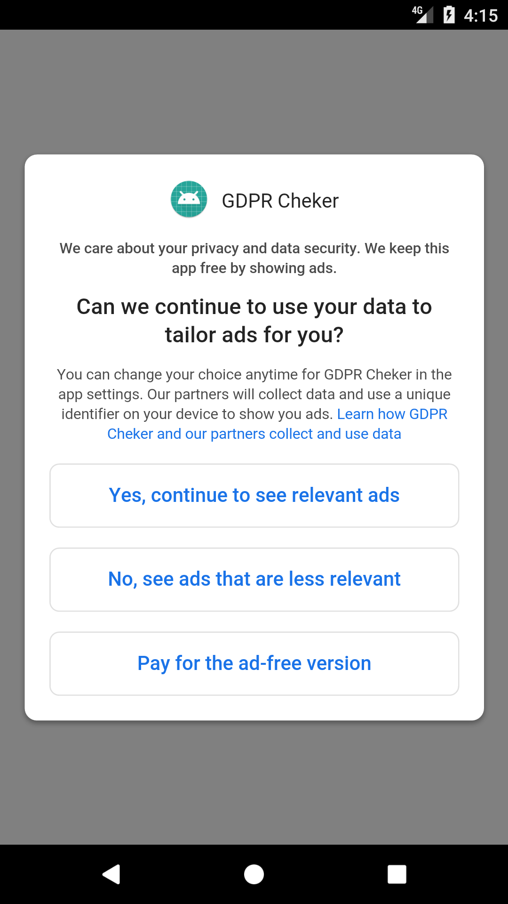

# GDPRChecker
GDPR Checker is a sample way to implement GDPR to you project

<p align="center">
  
</p>

## Getting Started
### Step 1. Add the JitPack repository to your build file 
Add it in your root build.gradle at the end of repositories:

```
	allprojects {
		repositories {
			...
			maven { url 'https://www.jitpack.io' }
		}
	}
```
### Step 2. Add the dependency

```
dependencies {
		implementation 'com.github.ixiDev:GDPRChecker:v0.1'
	}
```

## How To use

```
        setContentView(R.layout.activity_main);
        ....
        new GDPRChecker()
                .withContext(this)
                .withPrivacyUrl("https://www.example.com/privacy") // your privacy url
                .withPublisherIds("pub-xxxxxxxxxxxxxxxx") // your admob account Publisher id 
                .withTestMode() // remove this on real project
                .check();
    ...
    
```
